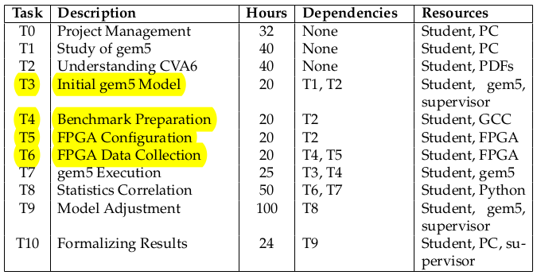
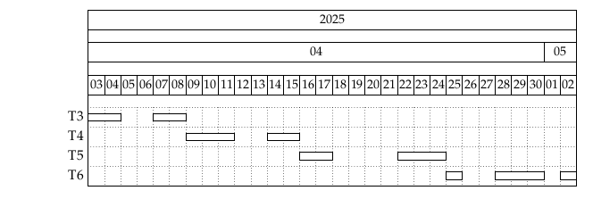

# Toma de Notas

## Reunion 19/12

- Delfi tiene acceso a varios papers.
- No funciona la teoria de Gonza con el Makefile. Olvidarse de Vivado por un tiempo.
- Tratar de obtener metricas para Spike y Verilator. Ya sean con los [performance counters](https://docs.openhwgroup.org/projects/cva6-user-manual/01_cva6_user/CSR_Performance_Counters.html) o con acceder directamente a los [registros csrs](https://docs.openhwgroup.org/projects/cva6-user-manual/06_cv64a6_mmu/riscv/priv.html#priv-csrs) (cabe aclarar que esto es para cv64a6_mmu y no cv64a6_imafdc_sv39).
- Crear una configuracion de CVA6 lo mas realista para Gem5:
  - Fijarse que gem5 activa la cache l2 por defecto, para desactivarla.
  - Correr un código para ver cuantas instrucciones tarda gem5 en preparar todo. Configurar el m5_dump_stat
  - Subir el archivo de configuración de gem5 y hacer un excel comparando las demás caracteristicas (implementadas vs no implementadas)
- Hacer comparaciones entre los simuladores y Gem5:
  - Empezar con programas basicos como solo aritmetica de enteros, luego punto flotantes y despues ciclos y por ultimo lectura y escritura de memoria. Y al final mezclar un poco de todo. Documentar exhaustivamente:
    - Indicar que programa estamos corriendo (ya sea de C o assembly).
    - Para los simuladores, indicar si estamos corriendo la version congelada de CVA6 o la mas reciente. Ademas indicar cuales de las configuraciones estamos corriendo (Ej: cv64a6_imafdc_sv39) y si cambiamos algun valor de las mismas (Ej: CVA6ConfigIcacheByteSize).
    - Para Gem5, indicar que version estamos usando (Ej: 25.0.1) y como es la configuracion de nuestros parametros.
  - Tomar todas las metricas que puedas, pero principalmente centrarse en Time, Miss de Cache y Numcycles.
  - Hacer una comparacion entre las metricas y llegar a alguna conclusion.
  - Usar la informacion dada por los simuladores para ir cambiando la configuracion del Gem5.

## Notas 19/12 a 08/01

- Esta [seccion](https://docs.openhwgroup.org/projects/cva6-user-manual/01_cva6_user/Parameters_Configuration.html) contiene una explicacion de los parametros y configuraciones del procesador, la cual son especialemente util para los simuladores. 
- Tenemos que `RVS` determina si se estamos en modo 
supervisor y `RVU` determina si estamos en modo usuario. Ambos estan activados en cv64a6_imafdc_sv39. 
- A su vez tenemos que `CVA6ConfigPerfCounterEn` determina si los performance counters estan activados, Esta activado por defecto en cv64a6_imafdc_sv39. La documentacion solo indica como usar los perfomance counters para cv32a60ax, pero supongo que debe ser lo mismo para cv64a6_imafdc_sv39.
- La configuracion cv64a6_imafdc_sv39 tiene por defecto `MMU`, `BTB`, `BHT`, `ICache`, `DCache`.
- La configuracion cv64a6_imafdc_sv39_hpdcache es bastante parecida a cv64a6_imafdc_sv39, solo que tiene una cache de datos mas optima (High Performance Data Cache).
- Spike (Simulador ISA): Spike está diseñado para ser rápido y verificar que la lógica del programa sea correcta. Por defecto, asume un modelo de "1 Instrucción = 1 Ciclo" (o muy cercano a ello). No simula la física del procesador, ni las colas de espera, ni la memoria caché real. Para Spike, leer de memoria es instantáneo.
- Verilator (Simulador RTL - CVA6): Verilator está simulando el diseño eléctrico real del procesador CVA6 (Ariane). Verilator nuestra como rinde un programa en el chip físico (en tiempo real).
- Spike no permite la obtencion de los performance counters. Segun la IA, esto tendria sentido pues solo verificar que la logica del programa sea correcta (que 1+1=2, que los saltos vayan al lugar correcto). No simula la Microarquitectura:
  - No tiene caché: la memoria es perfecta e instantánea. Por eso I-Cache Miss y D-Cache Miss dan 0.
  - No tiene predictor de saltos: simplemente ejecuta la siguiente instrucción lógica. Por eso Mispredicts da 0.
  - No tiene pipeline real: ejecuta una instrucción completa antes de pasar a la siguiente.
- El CPU time used y Wall clock de Verilator es cuanto tardo en correr el simulador, no es el tiempo que tardo en ejecutarse el programa.
- En Verilator, el tiempo de ejecucion de un programa lo estoy calculando a partir del numero de ciclos.
- En el este [paper](https://drive.google.com/drive/folders/1s2qMsnOHyl_ZMiDC9w0L0egYJkCIUeK_) hay una seccion que muestra como configuraron a gem5 para que sea parecido a CVA6 y nos dice que la Line Width es de 128 Bytes.
- Fran puede utilizar los simuladores para verificar si su Alu esta funcionando correctamente.
- En gem5 estas son las siguientes metricas que nos interesan (y en Verilator):
  - simSeconds (Segundos)
  - board.processor.cores.core.numCycles (Numero de Ciclos)
  - board.processor.cores.core.commitStats0.numInsts (Numero de Instrucciones)
  - board.processor.cores.core.ipc (IPC)
  - board.cache_hierarchy.l1icaches.overallAccesses::total (Accesos I Cache)
  - board.cache_hierarchy.l1icaches.overallMisses::total (Miss de I Cache)
  - board.cache_hierarchy.l1dcaches.overallAccesses::total (Accesos D Cache)
  - board.cache_hierarchy.l1dcaches.overallMisses::total (Miss de D Cache)
  - board.processor.cores.core.branchPred.lookups_0::total (Branch Predict)
  - board.processor.cores.core.branchPred.mispredicted_0::total (Branch Mispredicts)
 
### Analisis de Rendimiento en Verilator: Implementacion en C

Este analisis evalua el desempeno de un bucle con logica condicional (`modulo`) y una variable volatil.

**Codigo Fuente:**

```c
volatile int a = 0; 
for (int i = 0; i < 2000; i++) {
  if (i % 3 == 0) { 
    a += 5; 
  } else {
    a -= 1;      
  }
}
```

#### Tabla de Metricas (C)

| Registro | Metrica | Valor Hex | Valor Decimal | Descripcion |
| --- | --- | --- | --- | --- |
| **x18** | Ciclos Totales | `0x15329` | **86825** | Tiempo total de ejecucion en ciclos de reloj. |
| **x19** | Instrucciones Totales | `0x8f62` | **36706** | Total de instrucciones completadas (retired). |
| **x20** | L1 I-Cache Misses | `0x0d` | **13** | Fallos en cache de instrucciones. |
| **x21** | L1 D-Cache Misses | `0x0a` | **9** | Fallos en cache de datos. |
| **x22** | L1 I-Cache Access | `0xa9d0` | **43472** | Intentos de lectura de instrucciones. |
| **x23** | L1 D-Cache Access | `0x2efb` | **12027** | Accesos a memoria de datos (lectura/escritura). |
| **x24** | Branch Instructions | `0x123d` | **4669** | Saltos condicionales totales. |
| **x25** | Branch Mispredicts | `0x029f` | **671** | Predicciones de salto erroneas. |
| **x26** | Tiempo | `0x6c8` | **1736 us** | Tiempo absoluto a 50 MHz. |


#### Eficiencia de Cache (Misses vs. Hits)

- **Tasa de Misses:** Los valores son insignificantes (14 instrucciones y 7 datos). El programa es extremadamente pequeno y reside completamente en la cache L1 tras la carga inicial. Los fallos registrados corresponden exclusivamente a **cold misses** (llenado inicial de la cache).
- **Speculative Fetching:** Se observa una discrepancia notable entre los *I-Cache Access* (46122) y las *Instrucciones Totales* (36706). Esto es caracteristico de procesadores con ejecucion especulativa como el CVA6. El procesador pre-carga instrucciones basandose en predicciones de salto; si la prediccion falla, esas instrucciones se descartan (flush) antes de ejecutarse, pero el acceso a la cache ya se contabilizo.

#### Impacto de `volatile` en Memoria de Datos

- **Alta Latencia:** Se registran **12027 accesos a datos**. Al declarar `volatile int a`, se fuerza al compilador a ignorar optimizaciones de registro.
- **Costo por Iteracion:** En cada vuelta del bucle, la operacion `+=` o `-=` implica una secuencia de **Lectura -> Modificacion -> Escritura** directamente en la memoria (o cache), en lugar de usar registros internos del procesador. Esto explica por que el IPC (Instrucciones por Ciclo) es bajo (aprox 0.42), ya que la CPU pasa muchos ciclos esperando a la cache de datos.

#### Prediccion de Saltos (Branch Prediction)

- **Patron de Ejecucion:** La condicion `i % 3 == 0` genera un patron repetitivo de saltos: **Toma, No, No, Toma, No, No...**
- **Tasa de Error:** El bucle se ejecuta 2000 veces. Estadisticamente, el salto del `if` se cumple en 1/3 de las ocasiones (aprox 666 veces). El contador de *Mispredicts* es **671**, un valor casi identico a la ocurrencia del evento. Esto sugiere que el predictor de saltos no logra sincronizarse con el patron de periodo 3, fallando casi sistematicamente cada vez que la condicion cambia de estado.

---

### Analisis de Rendimiento en Verilator: Implementacion en Assembly

Version optimizada manualmente en ensamblador RISC-V, eliminando la restriccion `volatile` y gestionando variables en registros.

**Codigo Fuente:**

```asm
  li      t0, 0           # i = 0
  li      t1, 2000        # limit = 2000
  li      t2, 0           # a = 0
  li      t3, 3           # divisor = 3

loop_start:
  bge     t0, t1, loop_end    # if (i >= 2000) break;
  rem     t4, t0, t3          # t4 = i % 3
  bnez    t4, else_block      # if (rem != 0) goto else
  addi    t2, t2, 5           # a += 5
  j       loop_inc            # continue
else_block:
  addi    t2, t2, -1          # a -= 1
loop_inc:
  addi    t0, t0, 1           # i++
  j       loop_start
loop_end:
```

#### Tabla de Metricas (Assembly)

| Registro | Metrica | Valor Hex | Valor Decimal | Descripcion |
| --- | --- | --- | --- | --- |
| **x18** | Ciclos Totales | `0x99bc` | **39356** | Reduccion del ~54% respecto a C. |
| **x19** | Instrucciones Totales | `0x3191` | **12689** | Codigo mucho mas compacto. |
| **x20** | L1 I-Cache Misses | `0x05` | **5** | Fallos minimos (codigo lineal). |
| **x21** | L1 D-Cache Misses | `0x01` | **1** | Practicamente nulo. |
| **x22** | L1 I-Cache Access | `0x5b61` | **23393** | Accesos por fetch de instrucciones. |
| **x23** | L1 D-Cache Access | `0x09` | **9** | Accesos a datos casi inexistentes. |
| **x24** | Branch Instructions | `0x1a0c` | **6668** | Saltos de bucle y condicionales. |
| **x25** | Branch Mispredicts | `0x029e` | **670** | Similar a la version en C. |
| **x26** | Tiempo | `0x313` | **787 us** | Tiempo absoluto a 50 MHz. |

#### Desempeno y Latencia Aritmetica (IPC = 0.32)

- **Cuello de Botella en la ALU:** A pesar de ser codigo optimizado, el IPC es bajo (0.32). La causa principal es la instruccion **`rem`** (resto/division).
- **Costo de Hardware:** En la microarquitectura, la division no se resuelve en un solo ciclo. Requiere un circuito iterativo que consume multiples ciclos de reloj, bloqueando el pipeline de ejecucion hasta que el resultado esta listo. Aunque el acceso a memoria es perfecto, la complejidad aritmetica frena el rendimiento.

#### Optimizacion de Memoria

- **Uso de Registros:** La metrica mas impactante es la reduccion de accesos a datos (**D-Cache Access**), bajando de 12027 en C a solo **9** en Assembly.
- **Gestion Eficiente:** Esto confirma que las variables `i`, `limit`, `a`, y `divisor` se mantuvieron exclusivamente en los registros temporales (`t0` - `t4`). Los unicos accesos a memoria corresponden a la configuracion inicial del stack o prologo del programa, eliminando por completo el trafico hacia la RAM durante el bucle.

#### Consistencia en la Prediccion de Saltos

- **Validacion del Hardware:** Los *Branch Mispredicts* (670) son casi identicos a la version en C (671). Esto valida que el comportamiento del predictor de saltos es intrinseco al patron logico de los datos (i % 3) y no depende de la implementacion del software. El predictor falla consistentemente en el mismo punto del patron 1-de-3, independientemente de si las instrucciones provienen de C compilado o Assembly escrito a mano.

#### Conclusion Comparativa

- **Velocidad:** La version en Assembly es **2.18 veces mas rapida** (787 us vs 1722 us).
- **Eficiencia:** La version en C sufre por el uso de `volatile`, generando trafico de memoria innecesario. La version Assembly elimina este trafico, pero revela el costo "oculto" de la instruccion de division (`rem`), impidiendo que el procesador alcance un IPC cercano a 1.0.

### Analisis de un D-Cache Stress Test en Assembly

**Codigo Fuente:**

```asm
.section .text
.global main

.equ BUFFER_SIZE,       16384     # Tamaño del buffer en bytes (16KB)
.equ STRIDE_SIZE,       64        # Salto grande para romper localidad (64 bytes = cache line común)

main:
  la      sp, stack_top           # Configurar Stack Pointer

  la      a0, data_buffer
  li      a1, BUFFER_SIZE
  add     a2, a0, a1              # a2 = Dirección final del buffer

  mv      t0, a0                  # t0 = puntero actual
loop_write_linear:
  bge     t0, a2, end_phase_1
  li      t1, 0xAA55              # Dato patrón
  sw      t1, 0(t0)               # Store Word
  addi    t0, t0, 4               # Siguiente palabra
  j       loop_write_linear
end_phase_1:

  mv      t0, a0
  li      t2, STRIDE_SIZE         # Salto de 64 bytes
loop_read_stride:
  bge     t0, a2, end_phase_2
  lw      t1, 0(t0)               # Load Word (fuerza acceso a D-Cache)
  add     t0, t0, t2              # Salto grande
  j       loop_read_stride
end_phase_2:

  li      s11, 200          
loop_outer_thrash:
    
  addi    t0, a2, -4              
loop_inner_thrash:
  blt     t0, a0, end_inner_thrash
  lw      t1, 0(t0)               
  addi    t1, t1, 1               
  sw      t1, 0(t0)               
  addi    t0, t0, -128            
  j       loop_inner_thrash
end_inner_thrash:

  addi    s11, s11, -1
  bnez    s11, loop_outer_thrash

  fence

  li      a0, 0
  jal     exit

.section .bss
.align 4
  .comm data_buffer, 65536, 4 
    
  .comm stack_space, 4096, 4
stack_top:
```

#### Tabla Comparativa de Rendimiento

| Metrica | Registro | Config. A (32kB, 8-way) | Config. B (4kB, 1-way) | Diferencia / Impacto |
| --- | --- | --- | --- | --- |
| **Ciclos (Cycles)** | x18 | 233458 | 376200 | **+61.1%** (Mas lento) |
| **Instrucciones** | x19 | 180028 | 180028 | 0 (Idéntico) |
| **I-Cache Miss** | x20 | 11 | 11 | 0 |
| **D-Cache Miss** | x21 | **259** | **24080** | **+9,197%** (Critico) |
| **I-Cache Access** | x22 | 195759 | 231586 | +18.3% |
| **D-Cache Access** | x23 | 56579 | 56579 | 0 (Carga de trabajo igual) |
| **Branches** | x24 | 60050 | 60050 | 0 |
| **Branch Mispredicts** | x25 | 204 | 204 | 0 |
| **Tiempo (us)** | x26 | 4669 | 7524 | +61.1% |
| **IPC** | Calc | **0.7711** | **0.4785** | **-38%** (Caida de eficiencia) |

#### Colapso de la Cache (Miss Rate)

La metrica mas reveladora es `x21` (D-Cache Miss). Aqui se observa el impacto de reducir el tamaño y, mas importante aun, la asociatividad (vias). Podemos calcular la **Tasa de Fallos (Miss Rate)**:

- **Configuracion A (Ideal):** 259 fallos / 56579 accesos = **0.45%**. La cache funciona perfecto. Casi todos los datos se encuentran rapido.

- **Configuracion B (Critica):** 24080 fallos / 56579 accesos = **42.56%**. La cache fallo casi la mitad de las veces.

Al usar una cache "Direct Mapped" (1 via), ocurrieron **Conflict Misses**. El test esta diseñado para leer direcciones de memoria que compiten por la misma linea de cache (Thrashing).

#### Impacto en el Rendimiento (IPC y Ciclos)

La consecuencia directa de los fallos de cache es que el procesador debe detenerse (stall) esperando a que el bus de memoria traiga el dato.

- **Ciclos:** El procesador tardo **142742 ciclos extra** en terminar la misma tarea.
- **IPC (Instrucciones por Ciclo):** El IPC cayo de **0.77** a **0.47**.

#### Comparacion de Rendimiento: Normal vs HPD

| Metrica | Normal (32kB, 8-way) | HPD (32kB, 8-way) | Normal (4kB, 1-way) | HPD (4kB, 2-way) |
| --- | --- | --- | --- | --- |
| **Ciclos (Cycles)** | 233458 | 258735 | 376200 | 410091 |
| **Instrucciones** | 180028 | 180028 | 180028 | 180028 |
| **I-Cache Miss** | 11 | 11 | 11 | 11 |
| **D-Cache Miss** | 259 | 259 | 24080 | 25485 |
| **I-Cache Access** | 195759 | 182950 | 231586 | 233005 |
| **D-Cache Access** | 56579 | 80961 | 56579 | 80961 |
| **Branches** | 60050 | 60050 | 60050 | 60050 |
| **Branch Mispredicts** | 204 | 204 | 204 | 204 |
| **Tiempo (us)** | 4669 | 5174 | 7524 | 8201 |
| **IPC** | 0.7711 | 0.6958 | 0.4785 | 0.4390 |

### D-Cache Stress Test en C

**Codigo Fuente:**

```c
#define ARR_SIZE 8192 
int buffer[ARR_SIZE];

int main() {
  int stride = 1024; 
    
  for (int repeat = 0; repeat < 10; repeat++) {
    for (int i = 0; i < stride; i++) {
      buffer[i]            += 1;
      buffer[i + stride]   += 1;
      buffer[i + 2*stride] += 1;
      buffer[i + 3*stride] += 1;
    }
  }

  return 0;
}
```

#### Comparacion de Rendimiento: Normal vs HPD

| Metrica | Normal (32kB, 8-way) | Normal (4kB, 1-way) | HPD (32kB, 8-way) | HPD (4kB, 2-way) |
| --- | --- | --- | --- | --- |
| **Ciclos** | 1419896 | 1635923 | **1417873** | 1556365 |
| **Instrucciones** | 1,013,950 | 1013950 | 1013950 | 1013950 |
| **I-Cache Miss** | 29 | 29 | 29 | 29 |
| **D-Cache Miss** | **1033** | 38638 | **1033** | 36752 |
| **I-Cache Access** | 951712 | 913357 | 953218 | 968336 |
| **D-Cache Access** | 270936 | 438822 | **268633** | 348830 |
| **Branches** | 10272 | 10272 | 10272 | 10272 |
| **Branch Mispredicts** | 13 | 13 | 13 | 13 |
| **Tiempo (us)** | 28397 | 32718 | **28357** | 31127 |
| **IPC** | 0.7141 | 0.6198 | **0.7151** | 0.6515 |

## Reunion 08/01

- Ver si los resultados son determinísticos (probar algunas veces el mismo código). 
- Usar aling para que el código arranque siempre en el mismo lugar.
- Restar el offset inicial de num de instrucciones para calcular el IPC y que sea más comparable Verilator con Gem5.
- Hacer un for de pocas instrucciones (que entren en una línea de caché, si da fallos agregar NOPs antes para que se ejecute sin miss de caché) y que ejecute unas muchas iteraciones (probar distintas cantidades). Ojo con el uso de inmediatos, que puede hacer cosas raras.
- Leer Tesis Morillas para entender que cambios realizo
- Buscar qué versión de CVA6 que usaron en la tesis de Morillas y ver si hay diferencias con la que estamos usando actualmente. En el caso de no encontrar, contactar con Morillas


- Probar los benchmarks de Morillas
- Ver qué latencia está asignando Verilator a los accesos a Mem ppal ante un miss de caché.
- Hacer un objet dump para saber dónde está el código que se está ejecutando (Consultar Gonza)

## Notas 08/01 a 15/01

- Un dato importante a tener en cuenta es que estoy compilando los programas de Verilator de manera distinta a los de gem5. No creo que esto provoque una gran diferencia en las metricas pues solamente estoy comparando una seccion particular de codigo. En caso de necesitarlas a futuro asi es mas o menos como se compilan los programas:

- Compilacion de Verilator para RISCV y C:
```bash
/tools/bin/riscv-none-elf-gcc programa.S -I/cva6/verif/sim/dv/user_extension /config/gen_from_riscv_config/linker/link.ld -static -mcmodel=medany -fvisibility=hidden -nostdlib -nostartfiles -g verif/tests/custom/common/syscalls.c verif/tests/custom/common/crt.S -lgcc -I../tests/custom/env -I../tests/custom/common -o programa.o march=rv64gc_zba_zbb_zbs_zbc_zbkb_zbkx_zkne_zknd_zknh -mabi=lp64d
```

- Compilacion de gem5 para RISCV:
```bash
riscv64-linux-gnu-gcc programa.S gem5/util/m5/src/abi/riscv/m5op.S -static -nostdlib gem5/include -o programa
```

- Compilacion de gem5 para C:
```bash
riscv64-linux-gnu-gcc programa.c gem5/util/m5/src/abi/riscv/m5op.S -static -nostdlib -fno-builtin -e main gem5/include -lgcc -o programa
```

### Tesis de Morillas

- Usaron git para el proyecto, asi que la configuracion final que ellos crearon debe estar ahi (y capaz el bitstream)
- Usaron un compilador gcc de static link para evitar problemas de configuracion
- Tener en cuenta que el gem5 lo configuraron para que funcione con una imagen de Linux Ubuntu o sea que los benchmarks corren en FS y no FE
- En la siguiente tabla podemos ver que las tareas T3 a T6 son las que nos interesan conocer cuando se hicieron. Pues nos permitirian saber con que version del CVA6 estuvieron trabajando 



- Tomando en cuenta la agenda propuesta, podemos deducir que la version de CVA6 que utilizaron debe ser del alrededor de abril del 2025.



- Utilizan la Diligent Genesys 2 como FPGA. Tiene como memoria 1 GB DDR3 SODIMM
- Utilizan la configuracion cv64a6_imafdc_sv39_config_pkg.sv
- Utilizan MinorCPU para modelo en gem5
- CVA6 tiene 6 etapas mientras que MinorCPU tiene 4. Por lo tanto, para compensar incrementaron la ejecucion de todas las instrucciones en 2 ciclos (en gem5).
- Ambos tienen un sistema de scoreboard parecido
- En el CVA6 tenemos que la mayoria de operaciones tiene latencias fijas, pero algunas como la division pueden tardar entre 2 a 64 ciclos. El problema con esto es que en gem5 todas las latencias son fijas.
- Usan gem5.fast para correr las simulaciones
- La memoria de gem5 que mas se acerca a la de la Genesys 2 es la SingleChannelDDR3_1600 con 1GB
- La unica metrica que pudieron obtener de la fpga eran el numero de ciclos y instrucciones ejecutadas
- En gem5, un bloque de cache es de 64B mientras que en CVA6 es de 128B. Pero segun ellos, usar la cache de 64B en gem5 deberia causar minimos problemas
- Entre la pagina 55 y 59 se encuentran gran parte de las explicaciones de los valores de los parametros
- No entiendo muy bien la explicacion del branchpredictor (consultar a los profes)


## Reunion 15/01

- Tratar de cambiar el cache line size de gem5 de 64 a 128
- Identificar la latencia la memoria ram de Verilator
- Agregar en la tabla de Inicial VS Nuevo, los parametros de Verilator que encuentres (poner de donde lo encontraste)
- Analizar el procesamiento de instrucciones del CVA6 (seguir el camino de las instruccionesm, como y cuantas se ejecutan)
- Verificar las latencias de las unidades funcionales 
- Juntarse con Gonza para ver lo del object dump en makefile de Verilator

## Reunion 06/02

0) Modificar scripts de gem5/verilator para que se muestren las intrucciones del programa
1) Documentar los parametros de gem5 (poner lo que significa el parametro y de donde lo sacaste)
2) Ver si hay compresion de instrucciones en Verilator. Ver como se compilan los programas en Verilator y gem5
3) Verificar el parametro decodeInputWidth y decodeCycleInput
4) Probar daxpy 128 bytes en linea cache y 128 bits en fetch

Tareas opcionales:
- Revisar los siguientes parametros:
  - Cache
  - Functional Units
  - Ver que tenga sentido los ciclos de la MemoryWrite y MemoryRead (comparar los tiempos del procesador con la memoria)
- Tener en cuenta que los access y miss de cache pueden ser distintos en Verilator y Gem5. Ver como se miden para cada uno 
- Identificar la latencia de la memoria ram de Verilator. Investigar porque gtkwave me daba algo raro
