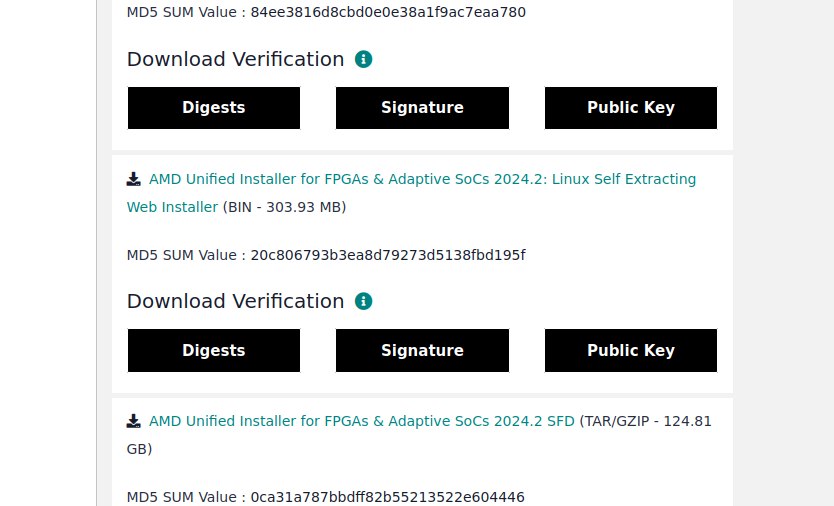
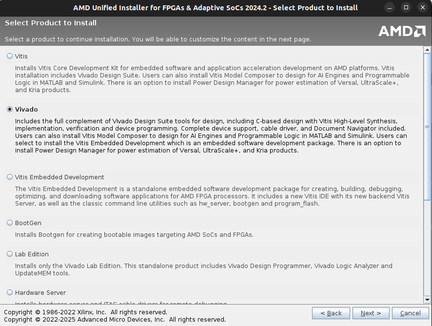
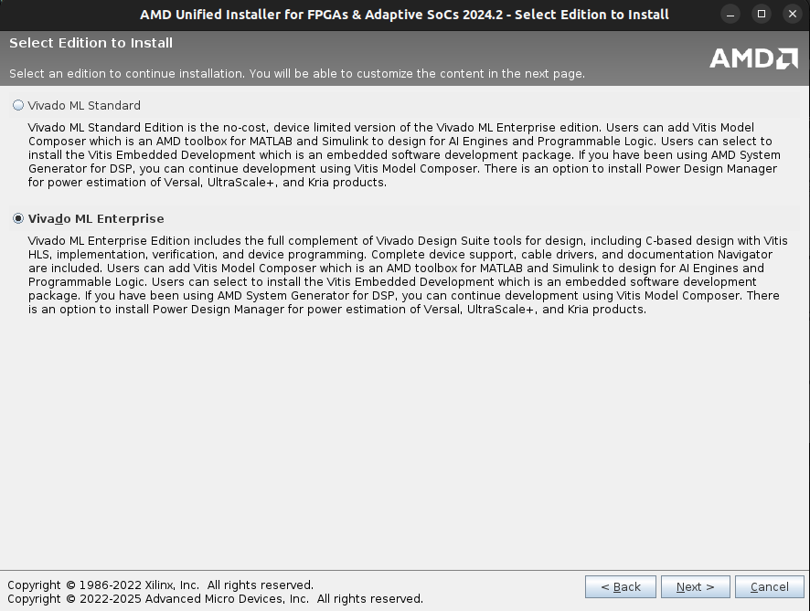
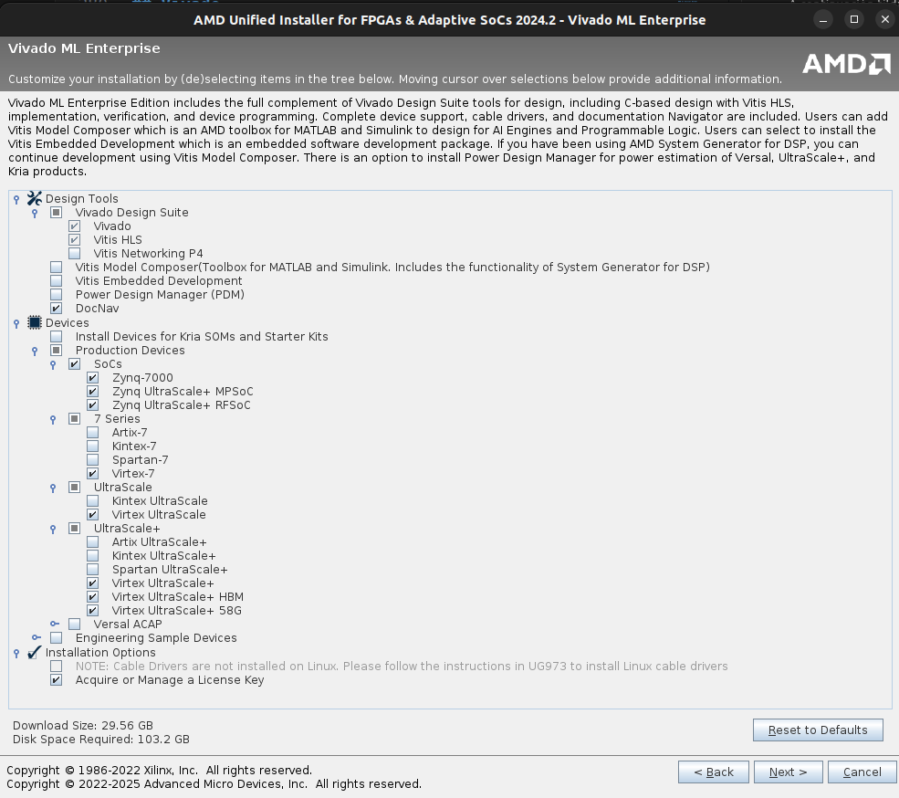
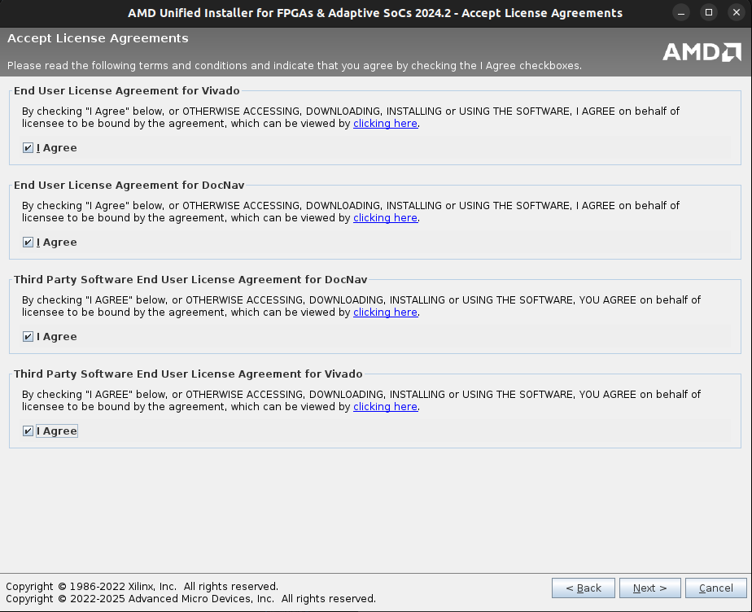
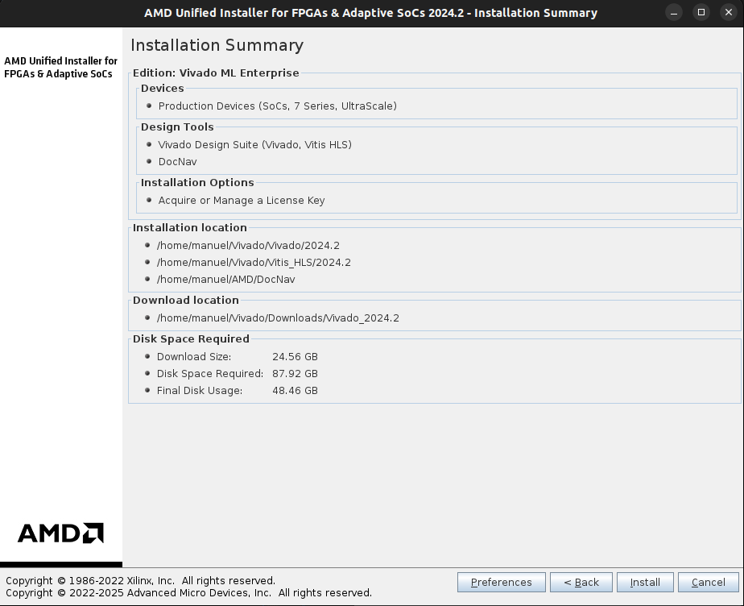

# CVA6 RISC-V Processor

Este proyecto tiene como objetivo analizar [CVA6](https://github.com/openhwgroup/cva6), un procesador de 64 bits con arquitectura RISCV de 6 etapas desarrollado en el lenguaje de descripción de hardware **SystemVerilog**. 

## Primeros Pasos

A continuación se detalla ordenadamente los pasos necesarios para poder empezar con el proyecto. Se asume que se trabajará desde un sistema operativo **Linux Debian**.

En este proyecto se utiliza [Docker](https://www.docker.com/), para evitar instalar todas las dependencias necesarias de CVA6 en el sistema operativo y lograr una mayor portabilidad. Se proveerá una imagen de Docker con todas las herramientas necesarias para trabajar con el procesador.

### 1) Instalación de Docker

Para instalar la herramienta se deben correr los comandos:

```bash
sudo apt-get update
sudo apt install -y docker.io
```

Verificar que se haya instalado correctamente:

```bash
sudo docker version
```

Permitir a Docker acceso al servidor X (GUI). Este comando debe ser ejecutado cada vez que se inicie la PC. Se recomienda agregarlo al archivo `.bashrc`:

```bash
xhost +local:docker
```

### Configuración opcional

Se recomienda realizar los siguientes pasos para facilitar el uso de la herramienta Docker:

#### Hacer que Docker inicie automáticamente al encender la PC

```bash
sudo systemctl enable docker 
```

#### No tener que usar sudo para correr comandos de Docker

Reemplazar `<user_name>` por el nombre de usuario de la PC (se puede obtener corriendo `whoami`).

```bash
sudo groupadd docker
sudo usermod -aG docker <user_name>
newgrp docker
```

Luego corre el siguiente comando, el cual no deberia pedirte `sudo`:

```bash
docker run hello-world
```

#### Acceder al contenido del contenedor desde VSCode

Para poder acceder al contenido del contenedor desde VSCode se debe instalar la extensión `Docker` en el apartado de `Extensions`.

### 2) Iniciar Docker

Iniciar el servicio:

```bash
sudo systemctl start docker
```

Verificar que se haya iniciado correctamente:

```bash
sudo systemctl status docker
```

Para apagar el servicio correr:

```bash
sudo systemctl stop docker
```

### 3) Descargar la imagen

Ingresar a [Docker Hub](https://hub.docker.com/r/manuel313/cva6/tags) para ver cuál es la etiqueta de la imagen más actualizada y luego descargarla (reemplazar `<tag>` por la etiqueta deseada):

```bash
docker pull manuel313/cva6:<tag>
```

Corroborar que se haya descargado correctamente:

```bash
docker images
```

### 4) Crear el Contenedor

Crear un contenedor `container_name` que será manipulado mediante una terminal Bash y el cual tendrá permisos para ejecutar aplicaciones de interfaz gráfica (reemplazar `<tag>` por la etiqueta de la imagen descargada y `<container_name>` por el nombre de contenedor deseado):

```bash
docker run -it --name <container_name> -e DISPLAY=$DISPLAY -v /tmp/.X11-unix:/tmp/.X11-unix manuel313/cva6:<tag> bash
```

Salir del contenedor corriendo el siguiente comando desde su terminal:
    
```bash
exit
```

### 5) Iniciar/Cerrar el Contenedor

Una vez creado el contenedor, para iniciarlo correr:

```bash
docker start <container_name>
```

Para ingresar al contenedor correr:

```bash
docker exec -e DISPLAY=$DISPLAY -it <container_name> bash
```

Para salir del contenedor correr desde la terminal del mismo:

```bash
exit
```

Para detener el contenedor correr:

```bash
docker stop <container_name>
```

## Correr pruebas

### Correr la primera prueba de Assembly

Para verificar que todo esté funcionando correctamente, se correrá una prueba de Assembly sobre el procesador CVA6. Dentro del contenedor, ejecutar los siguientes comandos:

```bash
source verif/sim/setup-env.sh
cd verif/sim
export DV_SIMULATORS=veri-testharness,spike
export TRACE_FAST=1
python3 cva6.py --target cv64a6_imafdc_sv39 --iss=$DV_SIMULATORS --iss_yaml=cva6.yaml \
--asm_tests ../tests/custom/hello_world/custom_test_template.S \
--linker=../../config/gen_from_riscv_config/linker/link.ld \
--gcc_opts="-static -mcmodel=medany -fvisibility=hidden -nostdlib \
-nostartfiles -g ../tests/custom/common/syscalls.c \
../tests/custom/common/crt.S -lgcc \
-I../tests/custom/env -I../tests/custom/common"
```

Una vez finalizado se creará una carpeta `out_year-month-day` con los resultados de la prueba. Para visualizar los resultados se puede correr el siguiente comando (reemplazando `<year-month-day>` por la fecha de la carpeta):

```bash
cd out_<year-month-day>/veri-testharness_sim
gtkwave custom_test_template.cv64a6_imafdc_sv39.vcd
```

### Correr la primera prueba de C

Ahora se correrá una prueba de C para verificar que el entorno esté configurado correctamente. Desde la raíz del proyecto, ejecutar los siguientes comandos:

```bash
source verif/sim/setup-env.sh
cd verif/sim
export DV_SIMULATORS=veri-testharness,spike
export TRACE_FAST=1
python3 cva6.py --target cv64a6_imafdc_sv39 --iss=$DV_SIMULATORS --iss_yaml=cva6.yaml \
--c_tests ../tests/custom/hello_world/hello_world.c \
--linker=../../config/gen_from_riscv_config/linker/link.ld \
--gcc_opts="-static -mcmodel=medany -fvisibility=hidden -nostdlib \
-nostartfiles -g ../tests/custom/common/syscalls.c \
../tests/custom/common/crt.S -lgcc \
-I../tests/custom/env -I../tests/custom/common"
```

Una vez finalizado, se creará una carpeta `out_year-month-day` con los resultados de la prueba. Para visualizar los resultados se puede correr el siguiente comando (reemplazando `<year-month-day>` por la fecha de la carpeta):

```bash
cd out_<year-month-day>/veri-testharness_sim
gtkwave hello_world.cv64a6_imafdc_sv39.vcd
```

### Correr programas en Assembly

Para correr programas en Assembly, se deben ejecutar los siguientes comandos desde la raíz (donde `<path_to_file>` es la ruta al archivo `.S` que se desea correr):

```bash
source verif/sim/setup-env.sh
cd verif/sim
export DV_SIMULATORS=veri-testharness,spike
export TRACE_FAST=1
python3 cva6.py --target cv64a6_imafdc_sv39 --iss=$DV_SIMULATORS --iss_yaml=cva6.yaml \
--asm_tests <path_to_file> \
--linker=../../config/gen_from_riscv_config/linker/link.ld \
--gcc_opts="-static -mcmodel=medany -fvisibility=hidden -nostdlib \
-nostartfiles -g ../tests/custom/common/syscalls.c \
../tests/custom/common/crt.S -lgcc \
-I../tests/custom/env -I../tests/custom/common"
```

Una vez finalizado, los resultados se guardarán en una carpeta `out_year-month-day` similar a las pruebas anteriores.

### Correr programas en C

Para correr programas en C, se deben ejecutar los siguientes comandos desde la raíz (donde `<path_to_file>` es la ruta al archivo `.c` que se desea correr):

```bash
source verif/sim/setup-env.sh
cd verif/sim
export DV_SIMULATORS=veri-testharness,spike
export TRACE_FAST=1
python3 cva6.py --target cv64a6_imafdc_sv39 --iss=$DV_SIMULATORS --iss_yaml=cva6.yaml \
--c_tests <path_to_file> \
--linker=../../config/gen_from_riscv_config/linker/link.ld \
--gcc_opts="-static -mcmodel=medany -fvisibility=hidden -nostdlib \
-nostartfiles -g ../tests/custom/common/syscalls.c \
../tests/custom/common/crt.S -lgcc \
-I../tests/custom/env -I../tests/custom/common"
```

Una vez finalizado, los resultados se guardarán en una carpeta `out_year-month-day` similar a las pruebas anteriores.

Se recomienda compilar el programa en C antes de correrlo. Para ello, se puede utilizar el siguiente comando (reemplazando `<program_name>` por el nombre del archivo `.c` y `<executable_name>` por el nombre del ejecutable que se desea crear):

```bash
gcc -Wall -Wextra -O3 -g -std=c99 -o <executable_name> <program_name>
./<executable_name>
```

### Consideraciones

A la hora de escribir programas en C tener en cuenta lo siguiente:
- Solo estan disponibles las librerías `stdio.h`, `stdint.h` y `string.h`.
- No se pueden usar las funciones `malloc` ni `free`.

Si se usa el simulador `veri-testharness`, se debe tener en cuenta que:
- El procesador solo puede correr por 2 millones de ciclos o 500 segundos, lo que ocurra primero.

## Crear Imagen Docker

En caso de querer crear una imagen de Docker con las herramientas básicas para trabajar con el procesador, se debe seguir los siguientes pasos.

Primero, ubicarse en la carpeta raíz de este proyecto y correr el comando (reemplazando `<username>` y `<tag>` por los valores deseados): 

```bash
docker build -t <username>/cva6:<tag>
```

Luego crear un contenedor con esta nueva imagen. Para ello, seguir los pasos detallados en la sección [Crear el Contenedor](#4-crear-el-contenedor) y [Iniciar/Cerrar el Contenedor](#5-iniciar/cerrar-el-contenedor). Una vez dentro del contenedor, se debe correr la secuencia de comandos:

```bash
source verif/sim/setup-env.sh
export DV_SIMULATORS=veri-testharness
bash verif/regress/smoke-tests-cv64a6_imafdc_sv39.sh
```

Se recomienda ejecutar los programas `hello_world.c` y `custom_test_template.S` como se detalla en la sección [Correr pruebas](#correr-pruebas) para verificar que el entorno se haya configurado correctamente.

Por último, se debe salir del contenedor sin cerrarlo. Una vez afuera, se debe crear una imagen a partir del contenedor modificado, corriendo el comando (reemplazando `<username>` y `<tag>` por los valores anteriores y `<container_name>` por el nombre del contenedor):

```bash
docker commit <container_name> <username>/cva6:<tag>
```

Verificar que la imagen se haya creado correctamente:

```bash
docker images
```

## Vivado

### Instalación

Ingresar al siguiente [link](https://www.xilinx.com/support/download/index.html/content/xilinx/en/downloadNav/vivado-design-tools/2024-2.html) y descargar la versión 2024.2 de Vivado para Linux. Para poder acceder al link debe crearse una cuenta de AMD.



Una vez descargado el instalador, darle permisos de ejecución y correrlo.

```bash
chmod +x FPGAs_AdaptiveSoCs_Unified_2024.2_1113_1001_Lin64.bin
./FPGAs_AdaptiveSoCs_Unified_2024.2_1113_1001_Lin64.bin
```

Luego de esto se abrira el instalador y se le pedira su cuenta AMD. Una vez hecho esto, tiene que seleccionar el producto a instalar que en nuestro caso es `Vivado`:



Después, seleccionar la versión `Vivado ML Enterprise`:



A continuación tildar las siguientes opciones de instalación:



Aceptar los terminos de licencia:



Elegir una carpeta para la instalación:


Y por último presionar instalar:



### Activar Licencia

(TODO)

### Crear proyecto

Primero clonar el siguiente repositorio:

```bash
git clone https://github.com/ManuelN313/cva6.git
cd cva6
```

Luego correr lo siguiente para instalar unas librerías necesarias:

```bash
sudo apt-get install autoconf automake autotools-dev curl git libmpc-dev libmpfr-dev libgmp-dev gawk build-essential bison flex texinfo gperf libtool bc zlib1g-dev
```

Después crear un directorio en la raíz del repositorio que se llama `tools`. Luego ubicarse en a `cva6/util/toolchain-builder/` y ejecutar los siguientes comandos:

```bash
export NUM_JOBS=8 #Esto sería para acelerar el proceso. Colocar un número que su hardware soporte
export INSTALL_DIR=/absolute/path/to/cva6/tools
bash get-toolchain.sh #Demora un tiempo
bash build-toolchain.sh $INSTALL_DIR #También tarda un tiempo
```
Luego de crearse el toolchain, volver a la raíz del proyecto e instalar `cmake`:

```bash
sudo apt-get update
sudo apt-get install -y software-properties-common lsb-release gnupg
sudo apt-key adv --fetch-keys https://apt.kitware.com/keys/kitware-archive-latest.asc
sudo add-apt-repository "deb https://apt.kitware.com/ubuntu/ $(lsb_release -cs) main"
sudo apt-key adv --fetch-keys https://apt.kitware.com/keys/kitware-archive-latest.asc
sudo add-apt-repository "deb https://apt.kitware.com/ubuntu/ $(lsb_release -cs) main"
```

Luego instalar los paquetes `help2man` y `device-tree-compiler`:

```bash
sudo apt-get install help2man device-tree-compiler
```

Y por último ejecutar el siguiente comando:

```bash
make fpga BOARD="vc707" 
```

En el caso que salté un error de que no se encuentra el comando `vivado`, ir a `path/to/Vivado/2024.2/` y ejecutar:

```bash
source settings64.sh
```
